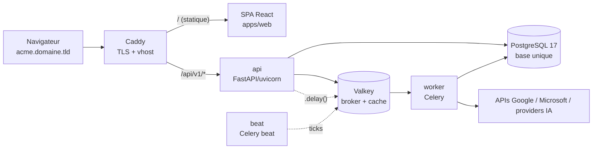
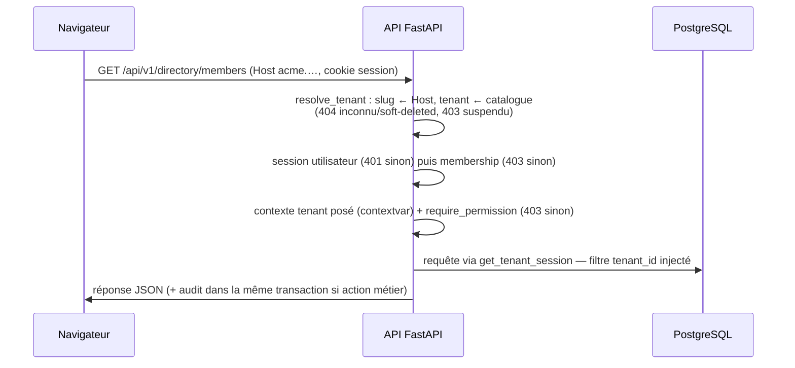
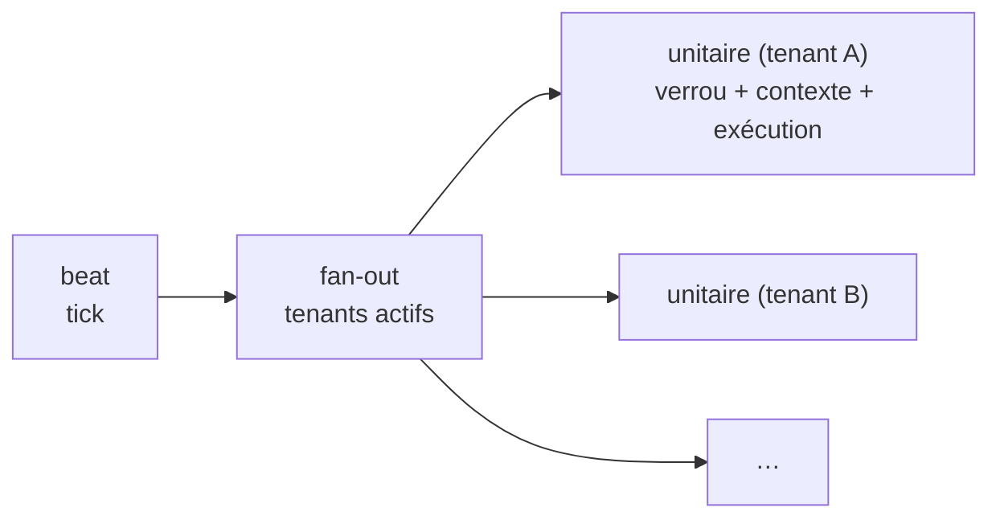

# Architecture — vue d'ensemble

> Comment le socle fonctionne, du navigateur à la base de données. Pour le détail de
> chaque brique backend : [`backend.md`](backend.md). Pour les décisions et leur
> pourquoi : [`adr/`](adr/README.md).

## Le produit en une phrase

Un **socle SaaS B2B multi-tenant** (auth, annuaire, connecteurs Google/Microsoft,
gateway IA, audit) sur lequel des **modules d'automatisation métier** se branchent
sans jamais modifier le cœur. Le socle est terminé ; la phase actuelle est le
développement des modules ([guide](creer-un-module.md)).

Choix structurants (détail dans les ADR) :

- **Monolithe modulaire** : un seul backend Python, découpé en packages, deux
  processus issus de la même image Docker (`api` et `worker`).
- **Base PostgreSQL unique** avec colonne `tenant_id` sur chaque table métier,
  isolation garantie par construction (ADR 0001, mécanisme ci-dessous).
- **Stack volontairement mûre et sur-documentée** (FastAPI, SQLAlchemy, Celery,
  React) : le développement est fortement assisté par IA, on ne retient que des
  briques que les modèles connaissent bien, verrouillées par du typage strict
  (pyright strict, TypeScript strict) et une CI bloquante.
- **Pas de back-office ni de stack d'observabilité** pour le MVP (ADR 0003, 0004) :
  administration par CLI/SQL, logs via `docker compose logs`.

## Composants et processus



Six services Compose : `postgres`, `valkey`, `api`, `worker`, `beat`, `caddy`.
`api`, `worker` et `beat` partagent **la même image Docker** — seule la commande de
démarrage change. Tout ce qui est lourd (appels providers, IA, listings) s'exécute
dans le worker, jamais dans le cycle requête/réponse HTTP.

## Le multi-tenant, mécanisme central

Un tenant = un client B2B, adressé par **sous-domaine** (`acme.domaine.tld`). Le
catalogue des tenants, les identités (`users`) et les appartenances (`memberships`)
sont des tables *non scopées* ; toute table métier hérite du mixin `TenantScoped`
et porte un `tenant_id`.

L'isolation ne repose pas sur la discipline des développeurs mais sur des
**garde-fous installés sur la classe `Session` SQLAlchemy** : une fois un contexte
tenant posé (contextvar), chaque SELECT/UPDATE/DELETE sur une table scopée reçoit
automatiquement le filtre `tenant_id = contexte courant`, chaque INSERT est
estampillé, et toute requête métier **sans** contexte lève `TenantContextError`.
Détail du mécanisme : [`backend.md` § tenancy](backend.md#tenancy--lisolation-par-construction).

## Flux d'une requête HTTP



Le point clé : **une seule chaîne de dépendances** fait toute la sécurité.
`require_permission("core.x.y")` compose `resolve_tenant` (sous-domaine ×
session × membership) puis vérifie le RBAC. Aucune route métier n'existe sans
elle ; les routes anonymes sont une liste fermée (health, login, OAuth,
acceptation d'invitation, callbacks/webhooks des connecteurs — authentifiés
autrement avant tout traitement).

## Flux d'une tâche périodique (fan-out)

Le beat est **statique** : une entrée par tâche (du socle ou déclarée par un
module), jamais une entrée par tenant. À chaque tick, la tâche de fan-out itère
les tenants actifs concernés et publie **une tâche unitaire par tenant**. Chaque
tâche unitaire : verrou Valkey anti-chevauchement, contexte tenant posé, exécution,
échec capturé et loggé — **un tenant en échec ne bloque jamais les autres**.



Le même patron sert au refresh des tokens de connecteurs, au rollup IA quotidien
et aux tâches périodiques des modules (`app/automation/scheduler.py`).

## Modèle de données — deux familles

| Famille | Exemples | Accès |
|---|---|---|
| **Non scopée** (plateforme) | `tenants`, `users`, `memberships`, `webhook_routes`, metering IA | `get_control_session` — code socle uniquement |
| **Scopée tenant** (`TenantScoped`) | annuaire, audit, connexions de connecteurs, tables `<module>_*` | `get_tenant_session` / `tenant_session()` — filtre automatique |

Un seul arbre Alembic (`apps/api/migrations/`) ; les tables des modules y entrent
par import du registre, sans toucher l'env. La suppression d'un tenant est un
**soft-delete** (`deleted_at`, ADR 0002) : invisible partout (HTTP 404, fan-out,
webhooks), données conservées, restauration par SQL.

## La frontière cœur / modules

```
app/core, tenancy, auth, directory, audit, connectors, ai, automation   ← le cœur (figé)
app/modules/<name>/                                                     ← les modules (la vie du produit)
```

Le cœur n'importe jamais un module (sauf l'unique ligne du registre
`app/automation/registry.py`) ; un module n'importe jamais un autre module et ne
consomme que quatre briques socle : session tenant, capabilities de connecteurs,
`AIGateway`, `record_audit_event`. Le contrat (`ModuleManifest`) est figé et
versionné ; les invariants sont vérifiés **au démarrage** (fail-fast en CI) et par
`tests/test_module_isolation.py`. Guide complet : [`creer-un-module.md`](creer-un-module.md).

## Sécurité — les lignes de défense

1. **Isolation tenant par construction** (garde-fous de session, ci-dessus).
2. **RBAC serveur uniquement** : la SPA masque des boutons pour l'UX, jamais comme
   barrière — tout contrôle est côté API.
3. **Aucun secret en clair en base** : mots de passe argon2id, tokens hachés
   (sha256), secrets TOTP et tokens de connecteurs chiffrés AES-256-GCM
   (interface `KeyProvider`).
4. **Logs JSON sans PII** ni contenu métier, corrélés par `request_id` ; l'audit
   métier vit dans `audit_events` (append-only), jamais dupliqué dans les logs.
5. **Surface d'entrée minimale** : seuls le navigateur et les webhooks providers
   entrent depuis Internet ; les webhooks sont authentifiés avant tout traitement
   et répondent de façon neutre en cas d'invalidité (pas d'oracle).
6. **Administration plateforme = accès shell machine** (CLI `saas`, SQL) — pas de
   rôle plateforme exposé sur le réseau (ADR 0003).

## Déploiement

CI bloquante (ruff, pyright strict, pytest, eslint, tsc, vitest) sur chaque PR ;
au merge sur `main`, publication des images vers GHCR. Le staging fonctionne en
**modèle pull** : un timer systemd sur la machine tire les nouvelles images toutes
les 5 minutes, applique les migrations et lance le smoke test — aucun accès
entrant, aucun runner. Procédure d'installation : README racine.
